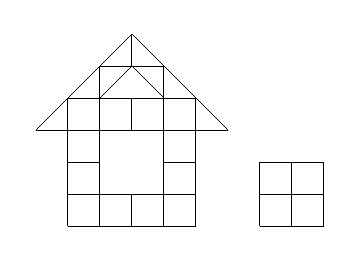
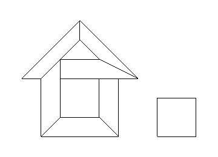

Merge solid polygons and decompose into convexes.

#### Example

Make a tilemap:

```typescript
    const gridSize = 32;
    const tiles: { x: number, y: number }[][] = [];
    
    function addRect(x: number, y: number) {
        x *= gridSize;
        y *= gridSize;
        tiles.push([
            {x: x, y: y},
            {x: x + gridSize, y: y},
            {x: x + gridSize, y: y + gridSize},
            {x: x, y: y + gridSize}
        ]);
    }

    function addSlopeBR(x: number, y: number) {
        x *= gridSize;
        y *= gridSize;
        tiles.push([
            {x: x, y: y},
            {x: x + gridSize, y: y},
            {x: x + gridSize, y: y + gridSize}
        ]);
    }

    function addSlopeBL(x: number, y: number) {
        x *= gridSize;
        y *= gridSize;
        tiles.push([
            {x: x, y: y},
            {x: x + gridSize, y: y},
            {x: x, y: y + gridSize}
        ]);
    }

    function addSlopeTL(x: number, y: number) {
        x *= gridSize;
        y *= gridSize;
        tiles.push([
            {x: x, y: y},
            {x: x + gridSize, y: y + gridSize},
            {x: x, y: y + gridSize}
        ]);
    }

    function addSlopeTR(x: number, y: number) {
        x *= gridSize;
        y *= gridSize;
        tiles.push([
            {x: x + gridSize, y: y},
            {x: x + gridSize, y: y + gridSize},
            {x: x, y: y + gridSize}
        ]);
    }

    addRect(4, 0);
    addRect(5, 0);
    addRect(4, 1);
    addRect(5, 1);

    addRect(-2, 0);
    addRect(-1, 0);
    addRect(0, 0);
    addRect(1, 0);

    addRect(-2, 1);
    addRect(1, 1);

    addRect(-2, 2);
    addRect(1, 2);

    addRect(-2, 3);
    addRect(-1, 3);
    addRect(0, 3);
    addRect(1, 3);

    addSlopeBR(-3, 3);
    addSlopeBR(-2, 4);
    addSlopeBR(-1, 5);

    addSlopeBL(0, 5);
    addSlopeBL(1, 4);
    addSlopeBL(2, 3);

    addSlopeTL(-1, 4);
    addSlopeTR(0, 4);

```



Decompose into convexes:

```typescript
    const mergePolygons = new MergePolygons();
    tiles.forEach(tile => mergePolygons.addPolygon(...tile)); // vertices need to be in counterclockwise order
    const convexes = mergePolygons.getConvexes();
```


